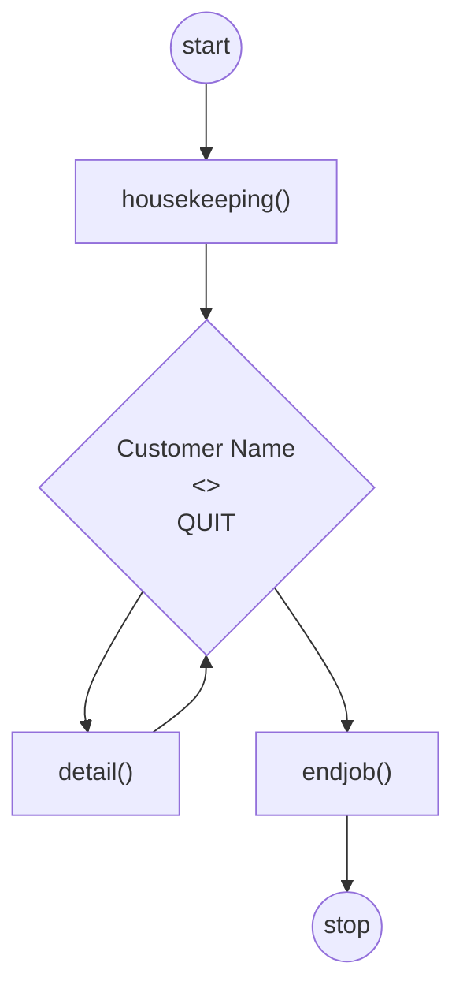

# PRLD
### Modules

1. Header
2. Body
3. Return

- House keeping - housekeeping()
- When calling a module we say we invoke it.
- The housekeeping() module is called up in the main program.

- The diamond symbol comes after this symbol in the flow-chart.
- If the value is true you use the letter "T" and true should flow to the 

- This loop needs to continuously loop until the user chooses to end the program.
- End of job only gets invoked when the user chooses to end the program.



# PROG
### Methods
```java
package one;

/**
 * Connor Davis
 * @author ST10068305
 */
public class App {
 public String getGreeting() {
	 return "Hello World!";
 }
 
 /**
 * This program demonstrates being able to reuse and call methods.
 *
 * @param args The command line arguments
 */
 public static void main(String[] args) {
	 // Here we can see we can call and reuse the method.
	 someMethod(10, 5);
 }
 
 // Static method that turns an integer
 public static int someMethod(int a, int b) {
	 // The return key word must always be used when the method isnt a void method.
	 int sum = a + b;

	 System.out.println("The sum is: " + sum);
	 
	 return sum;
 }
}
```
