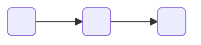
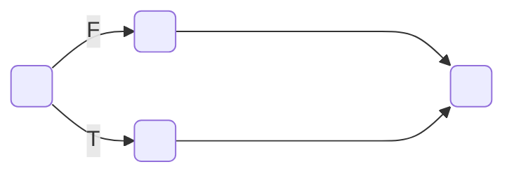
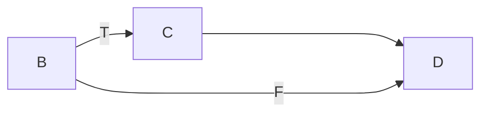

# PRLD
#### Understanding the Three Basic Structures
- Structure
	- Basic unit of programming logic
	- Each structure is one of the following
		- Sequence Structure
		- Selection Structure
		- Loop Structure
	- Any program can be constructed using one or more of these three structures

Sequence Example
   
   a,            b,           c
   
   1,            2,           3
   


#### Boolean
Dual-alternative

Single-alternative

#### Class BMI
```pseudocode
housekeeping()
	output "Welcome to BMI calculator."
	output HEIGHT_PROMPT
	input heightInInches
return
```
```pseudocode
detailLoop()
	output WEIGHT_PROMPT
	input weightInPounds

	set weightInKilograms = (weightInPounds * GRAMS_TO_POUNDS) / GRAMS_TO_KG
	set heightInMeters = (heightInInches * CM_TO_INCHES) / CM_TO_METERS
	set bodyMassIndex = weightInKilograms / (heightInMeters * heightMeters)

	output "The calculated BMI is ", bodyMassIndex
return
```
```pseudocode
endofjob()
	output "End of job."
return
```
```pseudocode
start
	Declarations
		num bodMassIndex
		num heightInInches, heightInMeters
		num weightInPounds, weightInKilograms
		num GRAMS_TO_POUNDS = 453.59
		num GRAMS_TO_KG = 1000
		num CM_TO_INCHES = 2.54
		num CM_TO_METERS = 100
		string HEIGHT_PROMPT = "Please enter your height in inches"
		string WEIGHT_PROMPT = "Please enter your weight in pounds"

	housekeeping()

	while height <> 0
		detailLoop()
	endwhile

	endofjob()
stop
```
