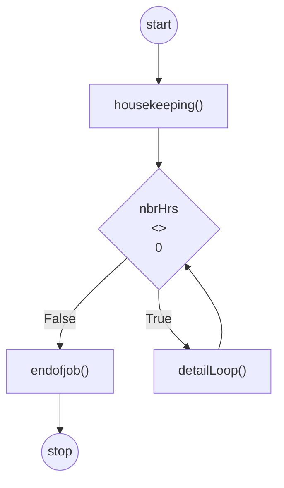

# Class Problem 2
Created: 2022-03-16 13:27

What do we need to do?
- Calculate the projected cost of a remodeling project
- Assume labor cost is $30 per hour
- Design a program that prompts the user for the number of hours projected for the project and the wholesale cost of materials.
- Compute and display the cost of the job which is the number of hours times the hourly rate plus 120% of the wholesale cost of materials.
- The program loops until 0 is entered for the number of hours.
- Use appropriate modules, including a end of program display when the program is finished.

```pseudo
start
	Declarations
		num LABOR_COST = 30
		num nbrHrs
		num materialCost
		num MATERIAL_MARKUP = 1.2
		num jobCost
		string HOURS_PROMPT = "Please enter the number of hours:"
		string MATERIAL_PROMPT = "Please enter the wholesale cost of the materials:"
		string END_OF_LINE = "End of program"

	housekeeping()

	while nbrHrs <> 0
		detailLoop()
	end while

	endofjob()
stop
```

```pseudocode
housekeeping()
	output HOURS_PROMPT
	input nbrHrs
return
```

```pseudocode
detailLoop()
	output MATERIAL_PROMPT
	input materialCost

	jobCost = (nbrHrs * LABOR_COST) + (materialCost * MATERIAL_MARKUP)

	output "Job cost: ", jobCost

	housekeeping()
return
```

```pseudocode
endofjob()
	output END_OF_LINE
return
```



## References
1. 